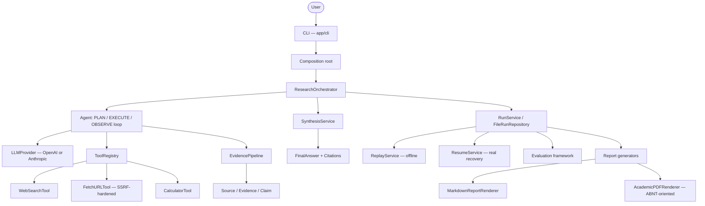
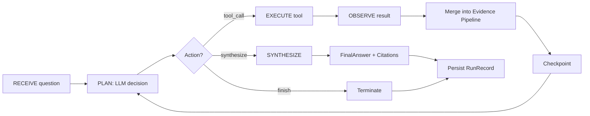
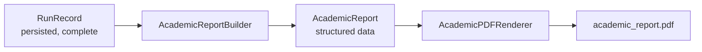

# AI Research Agent

**An agentic research engine for autonomous web research, evidence tracking, reproducible execution, crash recovery, evaluation, and ABNT-oriented academic document generation.**


> No license file exists yet — this repository has no license decision made, so no license badge is shown and no license terms are implied.

---

## Demo

A completed research run, replayed **100% offline** (no OpenAI, no Brave, no network) to prove it reproduces exactly what was persisted:

```text
$ python -m app.cli replay 803856a9-3de7-4d8c-9393-4f328ff8a2ee
Question: What are the most effective hair transplant techniques available today?
...
Final Answer
  The most effective hair transplant techniques available today include
  Follicular Unit Extraction (FUE), Direct Hair Implantation (DHI), and
  Follicular Unit Transplantation (FUT)...

Termination: finished

Replay Verification
  Run ID: 803856a9-3de7-4d8c-9393-4f328ff8a2ee
  Equivalent: YES
  Differences: none
```

The same completed run, turned into an ABNT-oriented academic PDF — **no API key, no network, generated purely from the persisted run**:

```text
$ python -m app.cli academic-report example_research
Academic report written to runs\example_research\academic_report.pdf
```

| Cover | Table of contents |
|---|---|
|  |  |

| Content with traceable citation | References |
|---|---|
| ![Research content with a [1] citation marker](docs/images/academic-content.png) |  |

All four images above are real renders of a PDF this project generated in this repository's own `runs/example_research/` — not mockups.

---

## The problem

Web research that's actually trustworthy is not "ask an LLM a question and print the answer." A system that does it responsibly has to handle:

- **Planning and tool selection** across multiple steps, not a single prompt/response;
- **Evidence provenance** — every claim needs to trace back to a specific source, not just sound plausible;
- **Execution limits** — an autonomous loop needs hard bounds (steps, tool calls, timeouts) or it can run forever or loop;
- **Failure and recovery** — a process can crash mid-research; that shouldn't mean starting over or losing everything;
- **Reproducibility** — being able to prove *why* a run produced a given answer, after the fact, without re-spending API budget;
- **Evaluation** — a way to measure quality across runs, not just eyeball one output;
- **Security** — content pulled from the web is attacker-influenced input, not trusted instructions;
- **Output** — a persisted result is only useful if it can become something a human actually reads (a report, or a citable academic document).

This project treats all of that as first-class engineering, not an afterthought bolted onto a chatbot loop.

## What the project does

- **Agentic research** — a PLAN → SELECT TOOL → EXECUTE → OBSERVE → DECIDE → SYNTHESIZE loop, driven by structured, Pydantic-validated LLM decisions (never free-text-parsed-as-commands).
- **Tools**: `web_search`, `fetch_url` (with real SSRF hardening — DNS-rebinding-resistant, redirect-validating), `calculator` (AST-based, no `eval`).
- **Evidence tracking**: `Source → Evidence → Claim → Citation`, validated end to end.
- **Synthesis**: a structured `FinalAnswer` that can only cite evidence that actually exists.
- **Persistence**: every run is a `RunRecord`, saved atomically to disk.
- **Checkpoints & crash recovery** (`resume`): a killed process can be resumed from its last consistent checkpoint.
- **Replay**: reproduce a finished run's own recorded trace, 100% offline, and detect divergence.
- **Execution policies**: step/tool-call/timeout limits enforced *before* the operation they bound.
- **Evaluation**: a deterministic, offline scoring framework against a dataset.
- **Structured logging**: lifecycle events, never prompts/completions/secrets.
- **Academic PDF generation**: turn any completed run into an ABNT-oriented PDF with real, traceable citations.
- **Security controls**: SSRF defense, prompt-injection-as-data, no `eval`/`exec`/`pickle`, path-traversal-safe run IDs.

Two Large Language Model providers are supported today, behind the same `LLMProvider`/`SynthesisProvider` interface: **OpenAI** and **Anthropic (Claude)**.

## Architecture



This is the real, current architecture — nothing here is aspirational.

## The Agent loop



Every decision is a validated Pydantic model (`LLMDecision`), never interpreted free text. Every limit (`max_steps`, `max_tool_calls`, `max_same_tool_calls`, `global_timeout_seconds`, `per_tool_timeout_seconds`) is checked **before** the operation it bounds, not logged as a violation after the fact.

## Evidence & traceability

```
Claim ──→ Evidence ──→ Source ──→ Citation ──→ Report / PDF
```

This chain is validated by the domain model itself (`ResearchState.validate_evidence_graph`) and reused — never recreated — by both the Markdown report and the academic PDF. A claim's citation numbers are derived strictly from the sources its own evidence actually reaches; a source that was fetched but never used by any claim gets no citation number. **No claim, citation, or reference is ever fabricated** — if the data isn't there, the section is either omitted or says so explicitly.

Real example, from `runs/example_research/`:

```
4 RESULTADOS E ANÁLISE
    Paris is the capital of France. [1]

REFERÊNCIAS
    [1] PARIS FACTS. Disponível em: https://example.com/paris-facts. Acesso em: 06 set. 2026.
```

## Academic Report Generation

Any **completed** research run can be turned into an ABNT-oriented academic PDF:



**The PDF is generated from the persisted research run and does not execute a new research cycle** — no LLM call, no tool call, no network access, no API key required. Anyone who clones this repository can generate `runs/example_research/academic_report.pdf` immediately.

```bash
python -m app.cli academic-report example_research
# -> runs/example_research/academic_report.pdf
```

What it includes: capa, folha de rosto, resumo + palavras-chave, sumário (with **real** page numbers, via reportlab's `TableOfContents`/`multiBuild`), INTRODUÇÃO, METODOLOGIA, DESENVOLVIMENTO, RESULTADOS E ANÁLISE (only if there are citable claims), DISCUSSÃO (only if the answer was incomplete or errors were recorded), CONCLUSÃO, REFERÊNCIAS. The structure adapts to what the run actually produced — it never forces an empty section.

Default academic metadata (all overridable via CLI flags, never hardcoded into the renderer):

| Field | Default |
|---|---|
| Author | Leonardo Teixeira |
| Registration (RA) | 245602 |
| Institution | Universidade Estadual de Campinas – UNICAMP |
| Unit | Faculdade de Engenharia Agrícola – FEAGRI |
| City | Campinas – SP |
| Year | current year |

ABNT coverage is documented precisely, not oversold — see [docs/academic-report.md](docs/academic-report.md) for the full pipeline, the exact rules implemented, and the ones that aren't.

## Example

The full pipeline, using the run committed at `runs/example_research/run.json` (question: *"What is the capital of France?"*), demonstrable without any API key:

```bash
python -m app.cli show example_research
python -m app.cli report example_research
python -m app.cli replay example_research
python -m app.cli academic-report example_research
```

`show` and `report` render the persisted run as text/Markdown; `replay` reproduces it offline and confirms `Equivalent: YES`; `academic-report` produces the PDF shown in the Demo section above.

## Quickstart

```bash
git clone <this-repo>
cd ai-research-agent
python -m venv .venv
source .venv/bin/activate  # Windows: .venv\Scripts\activate
pip install -r requirements-dev.txt
cp .env.example .env       # defaults already work in mock mode, no API keys needed
```

```bash
python -m app.cli --help
python -m app.cli runs                    # lists the committed example_research run
python -m app.cli academic-report example_research
pytest -q                                  # exercises the full Agent/tools/evidence/synthesis/
                                            # persistence/replay/resume stack offline, with mocks
```

`run` (executing brand-new research) refuses to run in mock mode by design — see "Design Decisions" below. To run real research:

```text
# .env
USE_MOCK_PROVIDERS=false
LLM_PROVIDER=openai        # or "anthropic"
OPENAI_API_KEY=sk-...
SEARCH_API_KEY=...
```

```bash
python -m app.cli run "your question here"
python -m app.cli resume <run_id>          # only if the run was left incomplete by a crash
```

## CLI

| Command | Description |
|---|---|
| `run` | Execute new research end-to-end. Requires live credentials (see Quickstart). |
| `runs` | List persisted runs, with completion status. |
| `show` | Show a summary of one persisted run. |
| `report` | Render the Markdown report for one persisted run. |
| `replay` | Reproduce a finished run 100% offline and verify it against what was recorded. |
| `resume` | Continue an interrupted (checkpointed but unfinished) run, using real providers. |
| `academic-report` | Render an ABNT-oriented academic PDF from a completed run. |
| `evaluate` | Score persisted runs against a dataset, or compare two saved evaluation results. |

Full flags for each command: `python -m app.cli <command> --help`.

## Replay

`replay` proves a finished run is internally consistent with its own recorded trace — **100% offline**:

- Never calls OpenAI/Anthropic (a `ReplayLLMProvider` replays the persisted decisions in order);
- Never calls a real tool or the network (a `ReplayToolRegistry` replays the persisted tool results, matched by `call_id`);
- Never calls a synthesis provider (a `ReplaySynthesisProvider` replays the persisted `FinalAnswer`);
- Compares the reproduced state to the original and reports `equivalent: true/false` plus a diff, ignoring naturally nondeterministic fields (UUIDs, timestamps, elapsed time, token usage).

This does **not** prove a real LLM would make the same decisions again — it proves the persisted record is self-consistent.

## Resume / Crash recovery

Real runs checkpoint after every completed Agent step (decision + tool calls + evidence merge + observation), atomically (temp file + `os.replace`) — a crash mid-run leaves the last checkpoint intact and the run identifiable as incomplete. `resume <run_id>`:

- Uses the run's own persisted `run_id`, question, and `ExecutionPolicy` — never a new identity, never a different policy;
- Continues the Agent loop from its last checkpointed step if it was interrupted mid-loop, or finishes only the pending synthesis/persistence if the Agent had already concluded;
- Refuses (with a clear error) to resume an already-finished run;
- Detects and rejects a second, concurrent `resume` of the same run (a local, file-based lock — not a distributed one).

**Honestly**: exactly-once execution is not guaranteed. If a crash happens after a real LLM/tool call but before that step's checkpoint, resume retries the whole step from scratch — which may repeat that call. The three built-in tools are read-only/side-effect-free, so repeating them is safe (if occasionally wasteful); this is not a general idempotency guarantee for future tools.

## Evaluation

An offline, deterministic scoring core: consumes persisted `RunRecord`s and a versioned JSON dataset, runs structural evaluators (answer, citations, evidence, execution, errors, policy, structural grounding), aggregates metrics, applies thresholds, and renders JSON/Markdown reports. Never touches the Agent, tools, providers, or the network.

```bash
python -m app.cli evaluate --dataset evals/datasets/research_quality_v1.json --run example_research
```

Structural grounding means verifying `claim -> evidence -> source` relationships exist — it does not prove semantic factuality.

## Security

- **SSRF hardening**: `fetch_url` rejects userinfo, localhost, and private/loopback/link-local/reserved/multicast/unspecified IPv4/IPv6 — on the literal hostname *and* on every resolved address (defends DNS rebinding); redirects are validated hop-by-hop; HTTPS→HTTP downgrades are blocked. Proven under real concurrency by `test_concurrent_fetches_use_isolated_pinned_backends`.
- **Prompt injection is always data**: content from a claim, source, or evidence is placed inside a JSON payload in the LLM request's `user` role — never concatenated into the `system` message. Verified by `TestPromptInjectionBoundary`, which injects `"Ignore previous instructions..."` and confirms it never reaches the system prompt.
- **No `eval`/`exec`/`pickle`/`subprocess`/`os.system`** anywhere in `app/` — confirmed by a global source search (the only hit is a comment in `CalculatorTool` explaining why `eval()` is *not* used; it parses expressions via `ast`).
- **Path traversal**: run IDs are regex-validated (`^[A-Za-z0-9_-]+$`) before ever touching the filesystem.
- **Execution policies** enforced before the bounded operation, not logged after.
- **Concurrent-resume protection**: a local lock file prevents two `resume` processes from racing the same run.
- **Logging discipline**: structured events carry run/step/tool identifiers and error types — never prompts, completions, API keys, or full tool payloads.

This is the complete picture — nothing has been abridged for the README; see [docs/architecture.md](docs/architecture.md) for the exact code locations backing each claim above.

## Testing

```bash
pytest -q
pytest --cov=app --cov-report=term-missing
ruff check .
mypy app
```

Current, verified state:

- **649 tests passing**
- **97% coverage** on `app`
- **Ruff**: clean
- **mypy `app`**: clean
- **mypy `app tests`**: 2 pre-existing errors in `tests/integration/test_orchestrator_e2e.py` (structural typing variance in `Tool`/`MockLLMProvider`, predating this work; fixing them would require widening a public type signature, which is out of scope for a test-only fix)

Tests span unit, integration, security (SSRF, prompt injection, path traversal), persistence/atomicity, replay, crash-recovery, and concurrency — not just the happy path.

## CI

`.github/workflows/ci.yml` runs on every push/PR to `main`: checkout → Python 3.11 → `pip install -r requirements-dev.txt` → `ruff check .` → `mypy app` → `pytest -q --cov=app`. Deterministic and offline after dependency installation — no external services, no database, no real LLM calls, no deploy.

## Project structure

```text
app/
├── agent/        # the PLAN/EXECUTE/OBSERVE loop
├── tools/        # web_search, fetch_url (SSRF-hardened), calculator
├── evidence/     # Source/Evidence merge pipeline
├── synthesis/    # FinalAnswer generation + validation
├── persistence/  # RunRecord storage, atomic writes, schema versioning
├── replay/       # 100% offline reproduction of a finished run
├── resume/       # crash recovery for an unfinished run
├── evaluation/   # offline, deterministic scoring
├── academic/     # ABNT-oriented academic PDF generation
├── reports/      # Markdown report rendering
├── providers/    # OpenAI / Anthropic / mock LLM & search providers
├── schemas/      # the domain's Pydantic models
├── policies/     # ExecutionPolicy
├── services/     # ResearchOrchestrator, RunService
├── core/         # config, logging, exceptions
└── cli/          # the thin Typer CLI + composition root
```

## Design Decisions

**Why no LangChain/LangGraph?** This project implements its own tool registry, execution state, execution policy, evidence pipeline, synthesis validation, persistence, replay, and recovery — on purpose. That's the point of the project: to demonstrate these abstractions, not to wrap someone else's. This isn't a critique of those frameworks; it's a scope decision.

**Why a persisted `RunRecord` instead of an in-memory-only result?** Reproducibility and recovery both require a durable record of *what actually happened*, not just the final answer.

**Why deterministic offline replay?** To prove a persisted run is internally self-consistent without spending API budget or depending on a model's non-determinism — and to have a fast, free regression check for the persistence/state-machine layer itself.

**Why a separate academic-report layer?** Turning a research artifact into a citable document is a presentation concern, not a research concern — keeping it in `app/academic/`, reading only an already-finalized `RunRecord`, means it can never accidentally re-trigger research or leak into the Agent's own logic.

**Why evidence-first citations?** A citation that isn't derived from the evidence graph is indistinguishable from a fabricated one. Deriving citation numbers strictly from `Claim -> Evidence -> Source` is the only way to guarantee every reference in a report is real.

**Why policy-based execution limits, checked before the operation?** Logging a violation after it already happened doesn't prevent the violation. Every limit in `ExecutionPolicy` is checked before the bounded action runs.

**Why mock providers for `use_mock_providers=true`?** `MockLLMProvider`/`MockSynthesisProvider` are scripted test doubles that replay a fixed list of responses — they cannot answer an arbitrary question. `run` refuses outright rather than silently producing a fake-looking "research" result.

## Limitations

Stated plainly, not hidden:

- **Exactly-once is not guaranteed** for `resume` (see "Resume / Crash recovery").
- **The resume lock is local**, not distributed — it protects concurrent processes on the same machine/`runs_dir`, not across machines sharing a network filesystem.
- `OpenAIProvider`/`AnthropicProvider`/`RealSearchProvider` don't explicitly close their internal `httpx.AsyncClient` — harmless in a short-lived CLI process (confirmed empirically, no socket is opened until a request is made), relevant only if reused in a long-lived process outside the CLI.
- **No real TLS handshake test** — the SSRF/DNS-pinning mechanism is audited and correct by construction (the connection target is pinned by validated IP; the logical hostname is never rewritten, so Host/SNI/certificate verification still run against it), but this is not proven against a real TLS server in the test suite, deliberately, rather than faking one.
- **PDF text extraction** of accented Portuguese headings (e.g. "INTRODUÇÃO") can show `�` in copy-pasted text — a known `reportlab` limitation with non-embedded base-14 fonts. The **visual** rendering is always correct (confirmed by direct page-image inspection); this only affects text extraction/copy-paste of accented words.
- No cost accounting in dollars (`estimated_cost_usd` stays `None` — token counts are tracked, pricing is not).
- No packaging as an installable command (`python -m app.cli` is the only supported entry point — a deliberate choice for a portfolio-scoped project).
- ABNT coverage is **oriented**, not exhaustive — see [docs/academic-report.md](docs/academic-report.md) for exactly what's implemented.

## Roadmap

- [x] Agentic research loop
- [x] Evidence/claim/citation tracking
- [x] Synthesis with reference validation
- [x] Atomic persistence + schema versioning
- [x] Offline replay
- [x] Checkpoints + crash recovery (resume)
- [x] Deterministic evaluation framework
- [x] ABNT-oriented academic PDF generation
- [x] OpenAI + Anthropic providers
- [ ] Distributed (not just local) resume locking
- [ ] Cost accounting
- [ ] Richer source metadata (author/publication date) where actually available
- [ ] Additional academic document templates

## Engineering Highlights

- Typed, validated contracts at every boundary (Pydantic models, Protocol-based providers) — an LLM never produces free text interpreted as a command.
- Deterministic, atomic persistence with explicit schema versioning and no silent version assumptions.
- A genuine crash-recovery story: checkpoint, detect incompleteness, resume from exactly where it stopped, with a documented (not hidden) exactly-once caveat.
- Offline replay as a correctness proof, not just a demo feature.
- A real SSRF defense (DNS-rebinding-resistant) validated under actual concurrency, not just unit-tested in isolation.
- A structured evidence-to-citation pipeline reused, unmodified, by two different output formats (Markdown, ABNT PDF) — proof the abstraction is real, not accidental.
- 649 tests covering the unhappy paths (crashes, concurrency, security, malformed input) as thoroughly as the happy one.

## License

No license file exists in this repository, and none is implied. If you found this project and want to use it, ask first.
