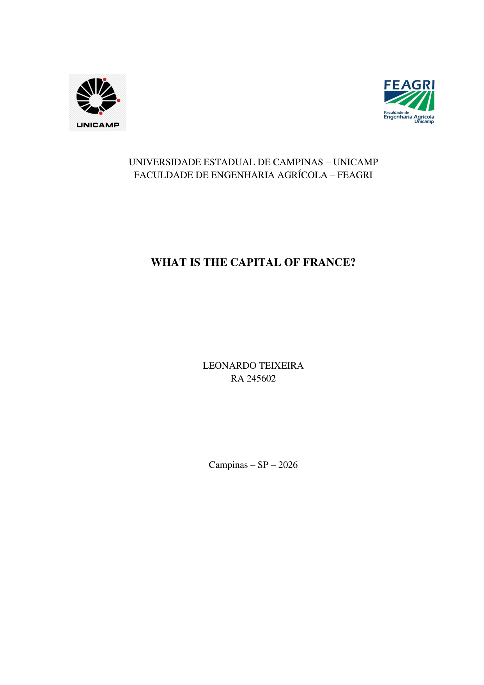
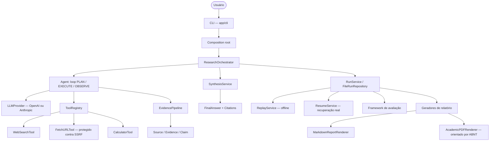
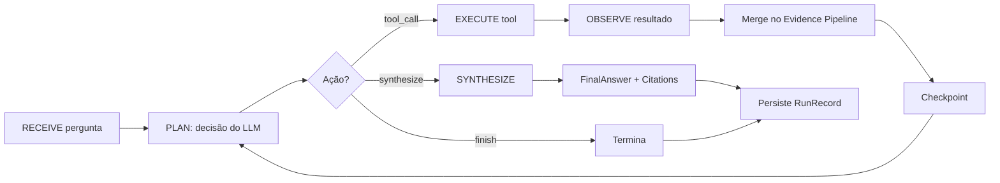
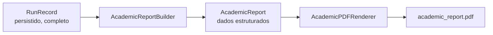

# AI Research Agent

**Um motor de pesquisa agentic para pesquisa web autônoma, rastreamento de evidências, execução reproduzível, recuperação de falhas, avaliação, e geração de documentos acadêmicos orientados por ABNT.**


> Não existe arquivo de licença neste repositório — nenhuma decisão de licença foi tomada, então nenhum badge de licença é mostrado e nenhum termo de licença é implícito.

---

## Demonstração

Uma pesquisa já concluída, reproduzida **100% offline** (sem OpenAI, sem Brave, sem rede) para provar que ela reproduz exatamente o que foi persistido:

```text
$ python -m app.cli replay 803856a9-3de7-4d8c-9393-4f328ff8a2ee
Question: What are the most effective hair transplant techniques available today?
...
Final Answer
  The most effective hair transplant techniques available today include
  Follicular Unit Extraction (FUE), Direct Hair Implantation (DHI), and
  Follicular Unit Transplantation (FUT)...

Termination: finished

Replay Verification
  Run ID: 803856a9-3de7-4d8c-9393-4f328ff8a2ee
  Equivalent: YES
  Differences: none
```

A mesma pesquisa concluída, transformada em um trabalho acadêmico em PDF orientado por ABNT — **sem API key, sem rede, gerado puramente a partir do run persistido**:

```text
$ python -m app.cli academic-report example_research
Academic report written to runs\example_research\academic_report.pdf
```

| Capa | Sumário |
|---|---|
|  |  |

| Conteúdo com citação rastreável | Referências |
|---|---|
| ![Conteúdo da pesquisa com marcador de citação [1]](docs/images/academic-content.png) |  |

As quatro imagens acima são renderizações reais de um PDF que este projeto gerou dentro do próprio `runs/example_research/` do repositório — não são mockups.

---

## O problema

Pesquisar na web de forma realmente confiável não é "perguntar pra um LLM e imprimir a resposta". Um sistema que faz isso com responsabilidade precisa lidar com:

- **Planejamento e seleção de ferramentas** em múltiplas etapas, não um único prompt/resposta;
- **Proveniência de evidência** — cada afirmação precisa ser rastreável até uma fonte específica, não apenas soar plausível;
- **Limites de execução** — um loop autônomo precisa de limites rígidos (steps, tool calls, timeouts) ou pode rodar para sempre ou entrar em loop;
- **Falha e recuperação** — um processo pode cair no meio da pesquisa; isso não deveria significar recomeçar do zero ou perder tudo;
- **Reprodutibilidade** — conseguir provar *por que* uma execução produziu determinada resposta, depois do fato, sem gastar orçamento de API de novo;
- **Avaliação** — uma forma de medir qualidade entre execuções, não só "olhar" um resultado;
- **Segurança** — conteúdo vindo da web é input potencialmente hostil, não instrução confiável;
- **Saída** — um resultado persistido só é útil se puder virar algo que um humano realmente lê (um relatório, ou um documento citável).

Este projeto trata tudo isso como engenharia de primeira classe, não como um detalhe adicionado depois em cima de um loop de chatbot.

## O que o projeto faz

- **Pesquisa agentic** — um loop PLAN → SELECT TOOL → EXECUTE → OBSERVE → DECIDE → SYNTHESIZE, guiado por decisões de LLM estruturadas e validadas por Pydantic (nunca texto livre interpretado como comando).
- **Tools**: `web_search`, `fetch_url` (com hardening real contra SSRF — resistente a DNS rebinding, validando redirects), `calculator` (baseado em AST, sem `eval`).
- **Rastreamento de evidências**: `Source → Evidence → Claim → Citation`, validado de ponta a ponta.
- **Síntese**: um `FinalAnswer` estruturado que só pode citar evidência que realmente existe.
- **Persistência**: cada execução é um `RunRecord`, salvo atomicamente em disco.
- **Checkpoints e recuperação de falhas** (`resume`): um processo morto pode ser retomado do último checkpoint consistente.
- **Replay**: reproduz o trace já registrado de uma execução concluída, 100% offline, e detecta divergência.
- **Políticas de execução**: limites de step/tool-call/timeout aplicados *antes* da operação que eles limitam.
- **Avaliação**: um framework de scoring determinístico e offline.
- **Logging estruturado**: eventos de ciclo de vida, nunca prompts/completions/segredos.
- **Geração de PDF acadêmico**: transforma qualquer execução concluída em um PDF orientado por ABNT com citações realmente rastreáveis.
- **Controles de segurança**: defesa contra SSRF, prompt injection tratado como dado, sem `eval`/`exec`/`pickle`, run IDs seguros contra path traversal.

Dois providers de LLM são suportados hoje, atrás da mesma interface `LLMProvider`/`SynthesisProvider`: **OpenAI** e **Anthropic (Claude)**.

## Arquitetura



Esta é a arquitetura real e atual — nada aqui é aspiracional.

## O loop do Agent



Cada decisão é um modelo Pydantic validado (`LLMDecision`), nunca texto livre interpretado. Cada limite (`max_steps`, `max_tool_calls`, `max_same_tool_calls`, `global_timeout_seconds`, `per_tool_timeout_seconds`) é verificado **antes** da operação que ele limita, não registrado como violação depois do fato.

## Evidência e rastreabilidade

```
Claim ──→ Evidence ──→ Source ──→ Citation ──→ Report / PDF
```

Essa cadeia é validada pelo próprio modelo de domínio (`ResearchState.validate_evidence_graph`) e reaproveitada — nunca recriada — tanto pelo relatório Markdown quanto pelo PDF acadêmico. Os números de citação de uma claim são derivados estritamente das fontes que sua própria evidência de fato alcança; uma fonte que foi buscada mas nunca usada por nenhuma claim não recebe número de citação. **Nenhuma claim, citação ou referência é inventada** — se o dado não existe, a seção é omitida ou diz isso explicitamente.

Exemplo real, de `runs/example_research/`:

```
4 RESULTADOS E ANÁLISE
    Paris is the capital of France. [1]

REFERÊNCIAS
    [1] PARIS FACTS. Disponível em: https://example.com/paris-facts. Acesso em: 06 set. 2026.
```

## Geração de Trabalho Acadêmico

Qualquer execução de pesquisa **concluída** pode virar um PDF acadêmico orientado por ABNT:



**O PDF é gerado a partir da execução de pesquisa persistida e não executa um novo ciclo de pesquisa** — sem chamada a LLM, sem chamada a tool, sem acesso à rede, sem necessidade de API key. Qualquer pessoa que clonar este repositório consegue gerar `runs/example_research/academic_report.pdf` imediatamente.

```bash
python -m app.cli academic-report example_research
# -> runs/example_research/academic_report.pdf
```

O que está incluído: capa, folha de rosto, resumo + palavras-chave, sumário (com números de página **reais**, via `TableOfContents`/`multiBuild` do reportlab), INTRODUÇÃO, METODOLOGIA, DESENVOLVIMENTO, RESULTADOS E ANÁLISE (só se houver claims citáveis), DISCUSSÃO (só se a resposta foi incompleta ou erros foram registrados), CONCLUSÃO, REFERÊNCIAS. A estrutura se adapta ao que a execução realmente produziu — nunca força uma seção vazia.

Metadados acadêmicos padrão (todos sobrescrevíveis via flags do CLI, nunca hardcoded no renderer):

| Campo | Padrão |
|---|---|
| Autor | Leonardo Teixeira |
| RA | 245602 |
| Instituição | Universidade Estadual de Campinas – UNICAMP |
| Unidade | Faculdade de Engenharia Agrícola – FEAGRI |
| Cidade | Campinas – SP |
| Ano | ano corrente |

A cobertura ABNT é documentada com precisão, não superestimada — veja [docs/academic-report.md](docs/academic-report.md) para o pipeline completo, as regras exatamente implementadas e as que não são.

## Exemplo

O pipeline completo, usando o run commitado em `runs/example_research/run.json` (pergunta: *"What is the capital of France?"*), demonstrável sem nenhuma API key:

```bash
python -m app.cli show example_research
python -m app.cli report example_research
python -m app.cli replay example_research
python -m app.cli academic-report example_research
```

`show` e `report` renderizam o run persistido como texto/Markdown; `replay` o reproduz offline e confirma `Equivalent: YES`; `academic-report` produz o PDF mostrado na seção Demonstração acima.

## Quickstart

```bash
git clone <este-repositorio>
cd ai-research-agent
python -m venv .venv
source .venv/bin/activate  # Windows: .venv\Scripts\activate
pip install -r requirements-dev.txt
cp .env.example .env       # os defaults já funcionam em modo mock, sem API keys
```

```bash
python -m app.cli --help
python -m app.cli runs                    # lista o run example_research commitado
python -m app.cli academic-report example_research
pytest -q                                  # exercita todo o stack Agent/tools/evidence/synthesis/
                                            # persistence/replay/resume offline, com mocks
```

`run` (executar uma pesquisa nova) se recusa a rodar em modo mock por design — ver "Decisões de Arquitetura" abaixo. Para rodar pesquisa real:

```text
# .env
USE_MOCK_PROVIDERS=false
LLM_PROVIDER=openai        # ou "anthropic"
OPENAI_API_KEY=sk-...
SEARCH_API_KEY=...
```

```bash
python -m app.cli run "sua pergunta aqui"
python -m app.cli resume <run_id>          # só se o run ficou incompleto por um crash
```

## CLI

| Comando | Descrição |
|---|---|
| `run` | Executa uma pesquisa nova, de ponta a ponta. Exige credenciais reais (ver Quickstart). |
| `runs` | Lista os runs persistidos, com status de conclusão. |
| `show` | Mostra o resumo de um run persistido. |
| `report` | Renderiza o relatório Markdown de um run persistido. |
| `replay` | Reproduz um run concluído 100% offline e verifica contra o que foi registrado. |
| `resume` | Continua um run interrompido (com checkpoint, mas incompleto), usando providers reais. |
| `academic-report` | Renderiza um PDF acadêmico orientado por ABNT a partir de um run concluído. |
| `evaluate` | Avalia runs persistidos contra um dataset, ou compara dois resultados de avaliação salvos. |

Flags completas de cada comando: `python -m app.cli <comando> --help`.

## Replay

`replay` prova que um run concluído é internamente consistente com seu próprio trace registrado — **100% offline**:

- Nunca chama OpenAI/Anthropic (um `ReplayLLMProvider` reproduz as decisões persistidas, em ordem);
- Nunca chama uma tool real ou a rede (um `ReplayToolRegistry` reproduz os resultados de tool persistidos, casados por `call_id`);
- Nunca chama um provider de síntese (um `ReplaySynthesisProvider` reproduz o `FinalAnswer` persistido);
- Compara o estado reproduzido com o original e reporta `equivalent: true/false` mais um diff, ignorando campos naturalmente não-determinísticos (UUIDs, timestamps, tempo decorrido, uso de tokens).

Isso **não** prova que um LLM real tomaria as mesmas decisões de novo — prova que o registro persistido é internamente consistente consigo mesmo.

## Resume / Recuperação de falhas

Execuções reais fazem checkpoint depois de cada step concluído do Agent (decisão + tool calls + merge de evidência + observação), atomicamente (arquivo temporário + `os.replace`) — um crash no meio deixa o último checkpoint íntegro e o run identificável como incompleto. `resume <run_id>`:

- Usa o `run_id`, a pergunta e a `ExecutionPolicy` já persistidos do próprio run — nunca uma nova identidade, nunca uma policy diferente;
- Continua o loop do Agent a partir do último checkpoint se ele foi interrompido no meio do loop, ou só finaliza a síntese/persistência pendente se o Agent já tinha concluído;
- Recusa (com erro claro) retomar um run já finalizado;
- Detecta e rejeita um segundo `resume` concorrente do mesmo run (um lock local baseado em arquivo — não um lock distribuído).

**Com honestidade**: execução exactly-once não é garantida. Se um crash acontecer depois de uma chamada real ao LLM/tool mas antes do checkpoint daquele step, o resume repete o step inteiro do zero — o que pode repetir aquela chamada. As três tools atuais são read-only/sem efeito colateral, então repetir é seguro (ainda que às vezes desperdice uma chamada) — isso não é uma garantia geral de idempotência para tools futuras.

## Evaluation

Um núcleo de scoring offline e determinístico: consome `RunRecord`s persistidos e um dataset JSON versionado, roda evaluators estruturais (resposta, citações, evidência, execução, erros, policy, grounding estrutural), agrega métricas, aplica thresholds, e renderiza relatórios JSON/Markdown. Nunca toca o Agent, tools, providers, ou a rede.

```bash
python -m app.cli evaluate --dataset evals/datasets/research_quality_v1.json --run example_research
```

Grounding estrutural significa verificar que as relações `claim -> evidence -> source` existem — não prova factualidade semântica.

## Segurança

- **Hardening contra SSRF**: `fetch_url` rejeita userinfo, localhost, e IPv4/IPv6 privado/loopback/link-local/reservado/multicast/unspecified — tanto no hostname literal quanto em todo endereço resolvido (defende contra DNS rebinding); redirects são validados hop a hop; downgrades HTTPS→HTTP são bloqueados. Comprovado sob concorrência real por `test_concurrent_fetches_use_isolated_pinned_backends`.
- **Prompt injection é sempre dado**: conteúdo de uma claim, source, ou evidência é colocado dentro de um payload JSON no papel `user` da requisição ao LLM — nunca concatenado na mensagem `system`. Verificado por `TestPromptInjectionBoundary`, que injeta `"Ignore previous instructions..."` e confirma que isso nunca chega ao prompt de sistema.
- **Sem `eval`/`exec`/`pickle`/`subprocess`/`os.system`** em nenhum lugar de `app/` — confirmado por uma busca global no código-fonte (a única ocorrência é um comentário em `CalculatorTool` explicando por que `eval()` *não* é usado; ele faz parse de expressões via `ast`).
- **Path traversal**: run IDs são validados por regex (`^[A-Za-z0-9_-]+$`) antes de tocarem o filesystem.
- **Políticas de execução** aplicadas antes da operação limitada, não registradas depois.
- **Proteção contra resume concorrente**: um arquivo de lock local impede que dois processos `resume` disputem o mesmo run.
- **Disciplina de logging**: eventos estruturados carregam identificadores de run/step/tool e tipos de erro — nunca prompts, completions, API keys, ou payloads completos de tools.

Este é o quadro completo — nada foi resumido só para o README; veja [docs/architecture.md](docs/architecture.md) para os locais exatos do código que sustentam cada afirmação acima.

## Testes

```bash
pytest -q
pytest --cov=app --cov-report=term-missing
ruff check .
mypy app
```

Estado atual, validado:

- **649 testes passando**
- **97% de cobertura** em `app`
- **Ruff**: limpo
- **mypy `app`**: limpo
- **mypy `app tests`**: 2 erros pré-existentes em `tests/integration/test_orchestrator_e2e.py` (variância estrutural de tipo em `Tool`/`MockLLMProvider`, anteriores a este trabalho; corrigi-los exigiria alargar uma assinatura de tipo pública, fora do escopo de uma correção só de teste)

Os testes cobrem unit, integração, segurança (SSRF, prompt injection, path traversal), persistência/atomicidade, replay, recuperação de falhas, e concorrência — não só o caminho feliz.

## CI

`.github/workflows/ci.yml` roda em todo push/PR para `main`: checkout → Python 3.11 → `pip install -r requirements-dev.txt` → `ruff check .` → `mypy app` → `pytest -q --cov=app`. Determinística e offline depois da instalação de dependências — sem serviços externos, sem banco de dados, sem chamadas reais a LLM, sem deploy.

## Estrutura do projeto

```text
app/
├── agent/        # o loop PLAN/EXECUTE/OBSERVE
├── tools/        # web_search, fetch_url (protegido contra SSRF), calculator
├── evidence/     # pipeline de merge de Source/Evidence
├── synthesis/    # geração e validação de FinalAnswer
├── persistence/  # armazenamento de RunRecord, escrita atômica, versionamento de schema
├── replay/       # reprodução 100% offline de um run concluído
├── resume/       # recuperação de falhas de um run incompleto
├── evaluation/   # scoring offline e determinístico
├── academic/     # geração de PDF acadêmico orientado por ABNT
├── reports/      # renderização de relatório Markdown
├── providers/    # providers de LLM/busca OpenAI / Anthropic / mock
├── schemas/      # os modelos Pydantic do domínio
├── policies/     # ExecutionPolicy
├── services/     # ResearchOrchestrator, RunService
├── core/         # config, logging, exceptions
└── cli/          # a CLI fina em Typer + composition root
```

## Decisões de Arquitetura

**Por que não usar LangChain/LangGraph?** Este projeto implementa seu próprio tool registry, estado de execução, execution policy, pipeline de evidência, validação de síntese, persistência, replay, e recuperação — de propósito. Esse é o ponto do projeto: demonstrar essas abstrações, não embrulhar as de outra pessoa. Isso não é uma crítica a esses frameworks; é uma decisão de escopo.

**Por que um `RunRecord` persistido em vez de um resultado só em memória?** Reprodutibilidade e recuperação exigem um registro durável do que *de fato aconteceu*, não só a resposta final.

**Por que replay offline determinístico?** Para provar que um run persistido é internamente auto-consistente sem gastar orçamento de API ou depender do não-determinismo de um modelo — e para ter uma checagem de regressão rápida e grátis da própria camada de estado/persistência.

**Por que uma camada separada de relatório acadêmico?** Transformar um artefato de pesquisa em um documento citável é uma preocupação de apresentação, não de pesquisa — mantê-la em `app/academic/`, lendo apenas um `RunRecord` já finalizado, garante que ela nunca pode acidentalmente disparar uma nova pesquisa ou vazar pra dentro da lógica do próprio Agent.

**Por que citações a partir da evidência?** Uma citação que não vem do grafo de evidência é indistinguível de uma inventada. Derivar números de citação estritamente de `Claim -> Evidence -> Source` é a única forma de garantir que toda referência num relatório é real.

**Por que limites de execução baseados em policy, verificados antes da operação?** Registrar uma violação depois que ela já aconteceu não impede a violação. Todo limite em `ExecutionPolicy` é verificado antes da ação limitada rodar.

**Por que providers mock quando `use_mock_providers=true`?** `MockLLMProvider`/`MockSynthesisProvider` são dublês de teste roteirizados que reproduzem uma lista fixa de respostas — eles não conseguem responder a uma pergunta arbitrária. `run` se recusa de cara, em vez de produzir silenciosamente uma "pesquisa" com aparência real mas falsa.

## Limitações

Ditas com clareza, não escondidas:

- **Exactly-once não é garantido** para `resume` (ver "Resume / Recuperação de falhas").
- **O lock de resume é local**, não distribuído — protege processos concorrentes na mesma máquina/`runs_dir`, não entre máquinas compartilhando um filesystem de rede.
- `OpenAIProvider`/`AnthropicProvider`/`RealSearchProvider` não fecham explicitamente seu `httpx.AsyncClient` interno — inofensivo num processo de CLI de vida curta (confirmado empiricamente: nenhum socket é aberto até a primeira requisição), relevante só se reutilizados num processo de vida longa fora da CLI.
- **Sem teste de handshake TLS real** — o mecanismo de pinning de SSRF/DNS é auditado e correto por construção (o alvo da conexão é fixado pelo IP já validado; o hostname lógico nunca é reescrito, então a verificação de Host/SNI/certificado continua rodando contra ele), mas isso não é provado contra um servidor TLS real na suíte de testes, deliberadamente, em vez de simular um de forma frágil.
- **Extração de texto do PDF** de títulos acentuados em português (ex.: "INTRODUÇÃO") pode mostrar `�` no texto copiado — uma limitação conhecida do `reportlab` com fontes padrão (base-14) não incorporadas. A renderização **visual** está sempre correta (confirmado por inspeção direta da imagem da página); isso só afeta a extração/cópia de texto de palavras acentuadas.
- Sem cálculo de custo em dólares (`estimated_cost_usd` permanece `None` — a contagem de tokens é rastreada, o preço não).
- Sem empacotamento como comando instalável (`python -m app.cli` é o único ponto de entrada suportado — uma decisão deliberada para um projeto de escopo de portfólio).
- A cobertura ABNT é **orientada**, não exaustiva — veja [docs/academic-report.md](docs/academic-report.md) para exatamente o que é implementado.

## Roadmap

- [x] Loop de pesquisa agentic
- [x] Rastreamento de evidência/claim/citação
- [x] Síntese com validação de referências
- [x] Persistência atômica + versionamento de schema
- [x] Replay offline
- [x] Checkpoints + recuperação de falhas (resume)
- [x] Framework de avaliação determinístico
- [x] Geração de PDF acadêmico orientado por ABNT
- [x] Providers OpenAI + Anthropic
- [ ] Lock de resume distribuído (não só local)
- [ ] Cálculo de custo
- [ ] Metadados de fonte mais ricos (autor/data de publicação) onde realmente disponíveis
- [ ] Templates acadêmicos adicionais

## Destaques de Engenharia

- Contratos tipados e validados em cada fronteira (modelos Pydantic, providers baseados em Protocol) — um LLM nunca produz texto livre interpretado como comando.
- Persistência determinística e atômica, com versionamento de schema explícito e nenhuma suposição silenciosa de versão.
- Uma história real de recuperação de falhas: checkpoint, detecção de incompletude, retomada de exatamente onde parou, com uma ressalva de exactly-once documentada (não escondida).
- Replay offline como uma prova de corretude, não só uma feature de demonstração.
- Uma defesa real contra SSRF (resistente a DNS rebinding), validada sob concorrência de verdade, não só testada isoladamente.
- Um pipeline estruturado de evidência-para-citação, reaproveitado sem modificação por dois formatos de saída diferentes (Markdown, PDF ABNT) — prova de que a abstração é real, não acidental.
- 649 testes cobrindo os caminhos infelizes (crashes, concorrência, segurança, input malformado) tão bem quanto o caminho feliz.

## Licença

Não existe arquivo de licença neste repositório, e nenhuma é implícita. Se você encontrou este projeto e quer usá-lo, pergunte antes.
